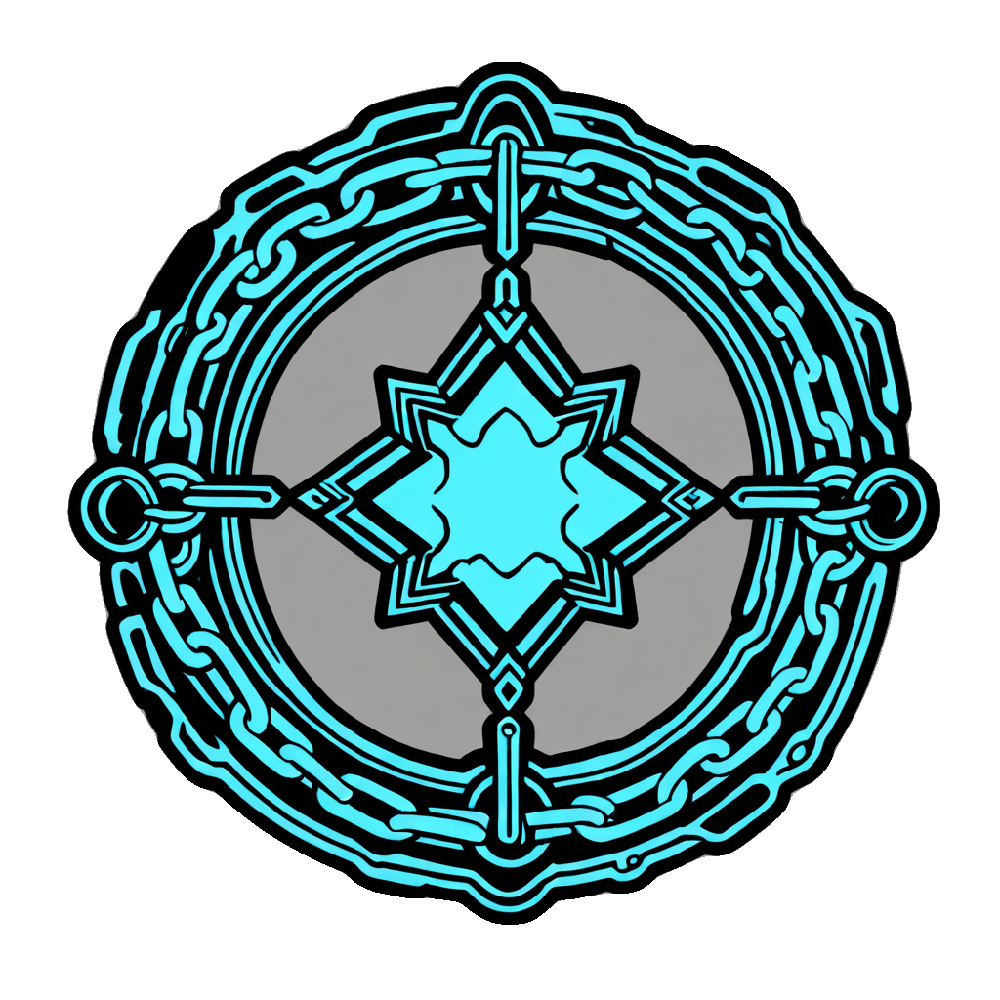
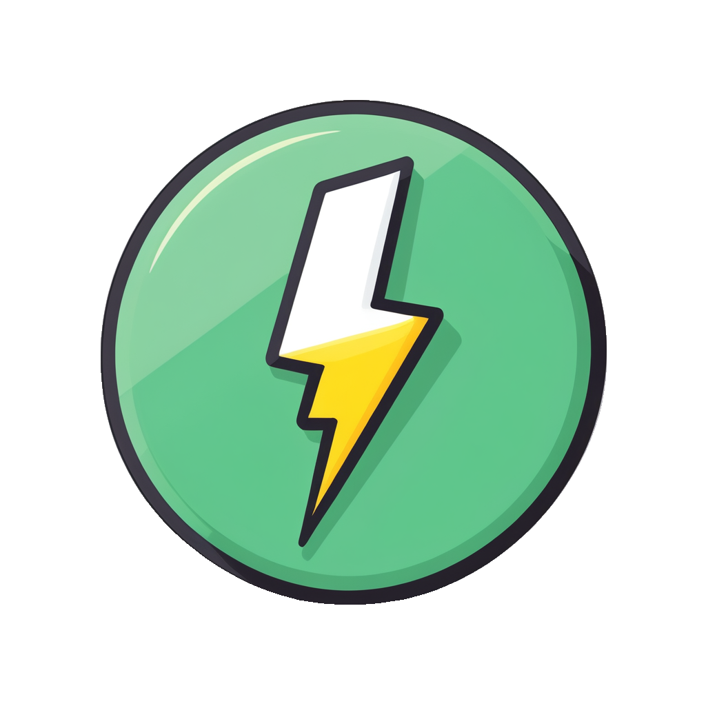
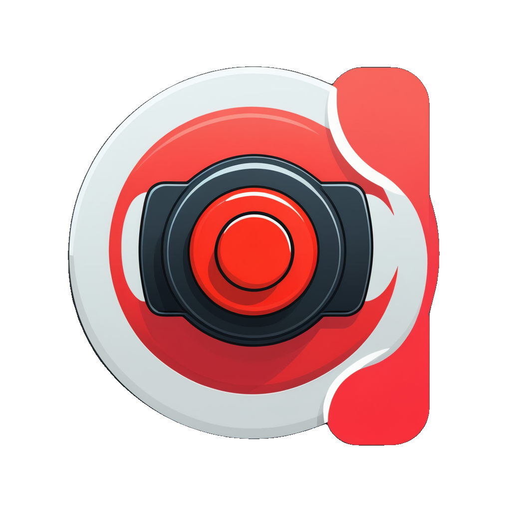
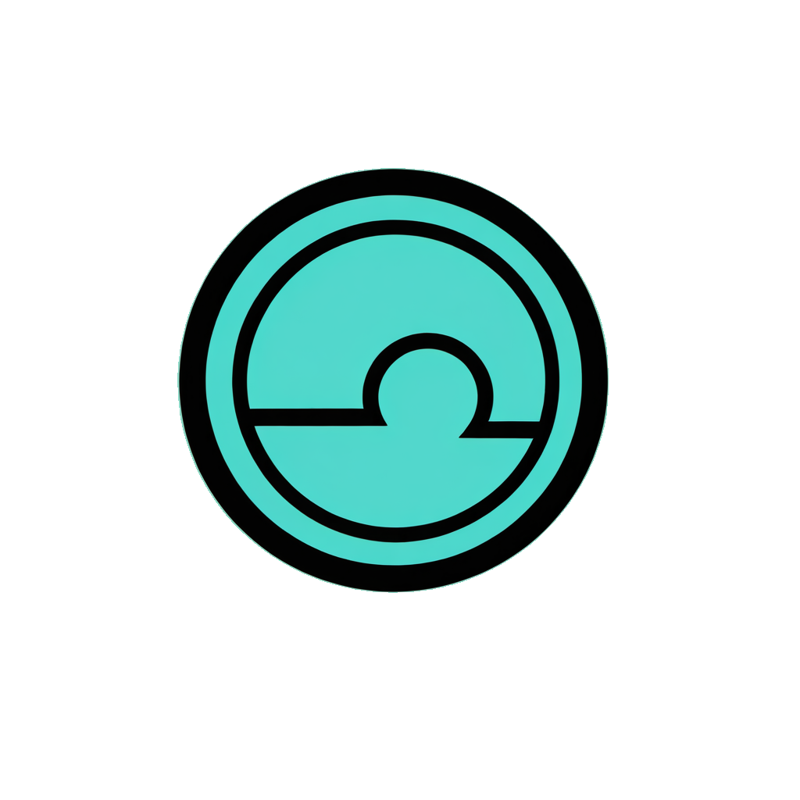
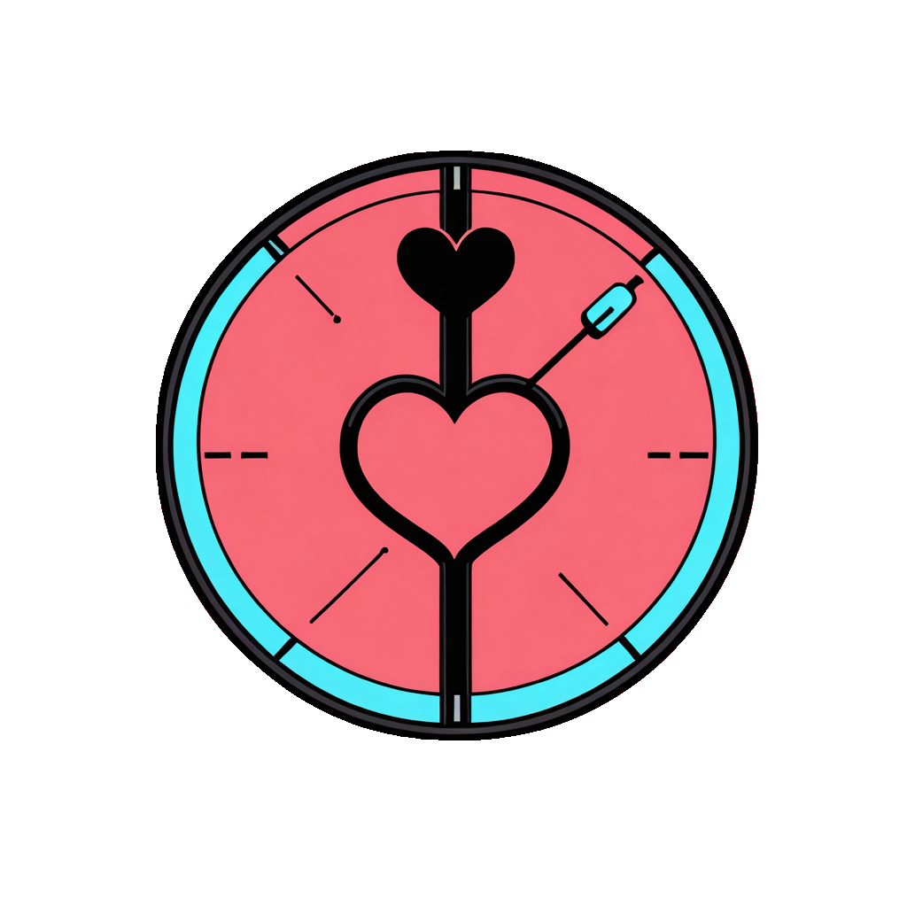

<div align="center">

# Haptix 🖐️⚡

### *Greetings, dragon slayers and rescuers of fair maids.*

[](https://github.com/OlafBerserker/Haptix/actions/workflows/ci.yml)
[](LICENSE)
[-orange.svg)](#its-early-okay)
[](#supported-devices)

**`v0.1` — Alpha: *Undying Shimmering***


</div>

Are you the kind of adventurer who tends to whip out **more than your sword** on occasion? Do you own a fairly advanced adult toy with Bluetooth pairing? Well, well, well. **Do read on.**

**Haptix** is a [SillyTavern](https://github.com/SillyTavern/SillyTavern) extension that lets the characters in your story **physically reach through the fourth wall** and into your choice of Bluetooth haptic device. You know — a gamepad or something. Or maybe that LELO F1S V3 personal "hygiene" device of yours that arrived in *discreet packaging.*

How does it work? The AI writes *"she runs her hand down your thigh,"* and — by the unholy union of Web Bluetooth and some genuinely questionable choices on my part regarding the expenditure of my free time — **something actually happens.**

---

## <a name="its-early-okay"></a>⚠️ It's EARLY, okay

This is an **early release.** Expect bugs. Instead of **rage-gooning**, kindly [report them](https://github.com/OlafBerserker/Haptix/issues) so I can do something about it. I promise I will read every issue with the grave seriousness this project does not deserve.

---

## What it actually does (the technical approach, in a nutshell)

- **Scene recognition.** *Is the user being touched somewhere the toy happens to be, in a pleasant way?* Haptix reads each AI message, works out **what's happening** and **how fast**, and drives the motor to match. A slow caress is a slow caress. "Full speed" is now a private matter between you and physics. There's a strict **contact gate** so the toy fires when a hand actually lands on you — not when she "traces a pattern in the air." (Atmospheric prose firing the motor was, briefly, a real bug. It is now a tested one.)
- **The device's own sensors.** *Is there a pencil jammed in your toy, or are you just happy to see me?* The built-in motion sensors estimate your, ah, **enthusiasm** and quietly fold it into the character's context — so she **notices, and reacts.** There is no hiding from a Bluetooth narc.
- **Manual override.** For those who tinker with the **+ / −** buttons mid-scene: the LLM interprets it as you **cueing the character** ("ease up," "a little faster," "that's too much teeth, milady") and transcribes it into the story. The toy is now a co-author. It will not be credited. It cannot read.
- **Gyroscopes.** Because if you **hold it up**, I'm telling the character. No holding until they say *"yes, thank you, you may hold it in front of me."* (The hint politely shuts up the instant things become, shall we say, **hands-on.**)

Plus the features I built instead of sleeping:

- **4 intensity modes** — Mild / Standard / Harsh / **Auto**, where Auto sizes the baseline from the **character's** physique. A dainty elf and a nine-foot barbarian should not hit identically. The curves are perceptually spaced, because "fast" felt limp and "frantic" tried to achieve orbit.
- **Autonomous sequences** — build-up, wave, pulse, throb, **edging**, organic, fireworks, and an **arousal-reactive auto-edge** that backs off at precisely the wrong moment. On purpose. You're welcome. / I'm sorry.
- **Two-toy mode** for power users (one scene, two devices — use your imagination, you clearly have one), **per-character calibration that's remembered**, settings that **persist**, and a tasteful little buzz for incidental "you got bumped in a crowd" contact.
- **Game controllers too** — DualSense / Xbox / most rumble pads, via the Gamepad API. No pairing, no permission prompt, no judgement.

---

<div align="center">

### The whole interface, freshly iconified

<table>
<tr>
<td align="center"><br><sub>Launcher</sub></td>
<td align="center"><br><sub>Connect</sub></td>
<td align="center"><br><sub>Disconnect</sub></td>
<td align="center"><br><sub>Arm</sub></td>
<td align="center"><br><sub>STOP</sub></td>
<td align="center"><br><sub>Test</sub></td>
</tr>
<tr>
<td align="center"><br><sub>Intensity</sub></td>
<td align="center"><br><sub>Sequence</sub></td>
<td align="center"><br><sub>Pattern</sub></td>
<td align="center"><br><sub>Calibrate</sub></td>
<td align="center"><br><sub>Arousal</sub></td>
<td align="center"><br><sub>Device</sub></td>
</tr>
</table>

*Generated locally, transparent-cut, and mildly cursed.*

</div>

---

## Supported devices

| Device | Status |
|---|---|
| **LELO F1S V3** (Harmony protocol) | ✅ Tested on actual hardware by an actual coward |
| **LELO F1S / F1S V2** (classic) | 🟢 Should work — same family, protocol auto-detected |
| **LELO Harmony line** (Tiani, Ida Wave, Hugo 2, Gigi 3, Tor 3, F2s, Switch, Sona 3 Cruise…) | 🟡 Auto-detected, **untested** |
| **Lovense / We-Vibe / Magic Motion / Satisfyer / Kiiroo** | 🧪 Experimental presets, **untested** — byte-bounded but unverified on real hardware |
| **Game controllers** (DualSense / Xbox / XInput pads) | 🎮 Rumble, no pairing needed |

Haptix sniffs out the right command protocol on connect. If your device misbehaves, the panel has a manual override and a **very large red button.**

---

## Install

**The easy way (SillyTavern UI):**
1. SillyTavern → **Extensions** → **Install Extension**.
2. Paste: `https://github.com/OlafBerserker/Haptix`
3. Reload. A 💗 button appears bottom-left.

**The script way:** run the installer for your OS from [`install/`](install/) — it drops Haptix into your SillyTavern `third-party` extensions folder.

**Browser note:** Web Bluetooth needs **Chrome or Edge** and a **secure context** — open SillyTavern at `http://localhost` / `http://127.0.0.1` (loopback counts) or over HTTPS. A plain LAN IP will *not* count as secure and the toy will simply sit there, judging you. Browser rule, not me being difficult.

---

## Using it

1. 💗 launcher → **Connect device** → pick your toy → press its **power button** when asked.
2. Tick **consent** → **Arm.** (Off by default. We are aggressively consent-forward, even with the gyroscope jokes.)
3. Adventure. Or hit **Test** with an act + pace, **Set Full Arousal Point** to calibrate the meter, and cycle **Intensity** / **Sequence** to taste.
4. **STOP** is always one click (or **Esc**) away. Tab away and it relaxes to zero on its own, like a gentleman.

---

## Safety & consent (the one bit I'm not joking in)

- **Off by default.** Nothing actuates until you connect *and* tick consent *and* press Arm — every session.
- **Always-visible emergency STOP**, an `Esc` hotkey, an inactivity dead-man auto-stop, a hard intensity cap, oscillation-rate limiting, and ramp limiting so nothing ever lurches.
- **Any uncertainty resolves to motor-off.** Disconnect, exception, NaN, lost heartbeat, hidden tab → zero. Fail-safe, not fail-spicy.
- It's a motor, on your body. Start low, you can always go up, and listen to your body over my software.

---

## Tested

Yes. Genuinely. This ridiculous thing has a **CI pipeline,** and I would like that on the record.

[](https://github.com/OlafBerserker/Haptix/actions/workflows/ci.yml)

```
$ npm test
Haptix edge-case harness:  47 passed, 0 failed
Haptix integration:        12 passed, 0 failed
```

Two hardware-free, fully deterministic suites run on every push (and locally via `npm test`):

- **Edge-case harness** (`test/edge.test.mjs`, 47 checks) — the safety-critical layer, pinned in code so a refactor can't silently unbound it: safety-gate clamps (NaN / Infinity / negative / over-cap → 0), ramp + oscillation limits, dead-man + heartbeat watchdogs; motor-command encoders (every byte stays in range for **any** input); pattern sequences + the actuator waveform envelope (amplitude provably in `[0,1]` — no motor overdrive); the classifier's **contact gate** (atmosphere does **not** fire the motor — the cardinal sin); and sensor decode + config integrity.
- **Integration** (`test/integration.test.mjs`, 12 checks) — boots the controller against a mocked browser + LLM and drives full **message → classify → actuate** flows: the LLM contact path, the regex fallback, the no-misfire guard, and the consent gate (disarmed = nothing moves, period).

No device and no LLM needed to run them — the only dignified way to test this.

---

## Privacy

Free software, **for entertainment only, completely offline and private.** No cloud, no telemetry, no analytics, no accounts. Haptix talks to your browser and your toy and **nobody else.** What happens in your trousers stays in your trousers — I genuinely cannot see it and have deliberately built nothing that could.

---

## Want your toy supported, or got ideas? 💌

The supported list is short because **I can only build (and trust) what I can actually test,** and my drawer of devices is tragically small.

- **Device not listed?** [Open an issue](https://github.com/OlafBerserker/Haptix/issues) and tell me exactly what you've got.
- **Really** want it supported? **Send me one — brand-new, factory-sealed, fresh from the manufacturer, still in the shrink-wrap.** For the love of all that is hygienic: **NOT your actual, well-loved toy.** A *new-in-box* unit, which I will then study with test tubes and other Serious Scientific Gear. Your gadget gets Officially Supported™ and immortalized in the changelog.
- **Or** fork the code and make it work yourself, you neckbearded king.
- I'm also after **ideas to push some toys further** — if you know your device speaks a richer protocol, tell me.

No toy too weird. (Okay — *some* toys too weird. Send them anyway.)

---

## Disclaimer

Not affiliated with, endorsed by, or blessed by LELO or any device maker. Protocol details are interoperability facts re-implemented from public sources. It **shouldn't** break your toys or your "gear" — but if it does, it is somehow your fault, because I said so. Use at your own risk, and possibly your own delight. No warranty, express or implied, including fitness for *that* particular purpose.

## License

[MIT](LICENSE) — do whatever, just don't blame me.

---

<div align="center">

*Made with caffeine, Web Bluetooth, 59 passing tests, and choices I stand by exactly as much as I'm low-key ashamed of them.*

</div>
